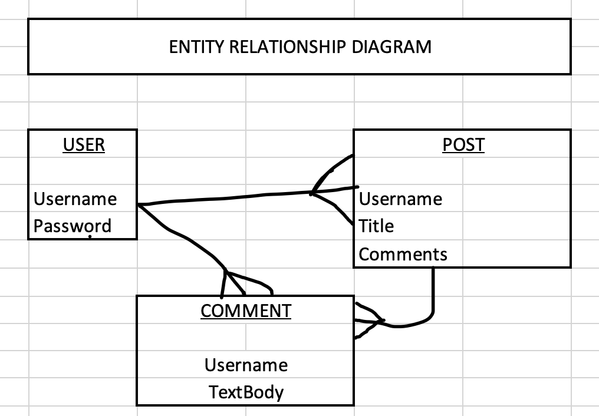

# MyFace Blog

For my second project in my Software Engineering Immersive bootcamp, I've created a simple blog for users to login with a unique username to post about anything their hearts desire. With full CRUD capability, users can create, read, update, and delete any post specific to their username.

Posts are displayed on the homepage. From there, users can select a post to view on its own page to see comments for the post.

---

# User Stories

AAU, I would like to visit this site to post interesting memoirs and tidbits about daily life and subjects I care about.

AAU, I would like to leave comments on posts and share thoughts with a community.

---

# Wireframes

At the start of the project, the following wireframes loosely resemble the goal.

Login/Signup Page

Home Page

Create Post Page

# Entity Relationship Diagram

Shown above, the Entities in this app are the User, the Posts, and the Comments.

A single user can have many posts, and they can have many comments.

A single post can have many comments, but will only belong to one user.

---
# CRUD Routes

| Method | Path |
| ----------- | ----------- |
| GET | /posts |
| GET | /posts/new |
| POST | /posts |
| GET | /posts/:id/edit |
| PUT | /posts/:id |
| GET | /posts/:id |
| DELETE | /posts |
| GET | /user/signup |
| POST | /user/signup |
| GET | /user/login |
| POST | /user/login |
| POST | /comment/:postId |
| DELETE | /comment/:postId/:commentId |
| GET | /comment/:id/edit |
| PUT | /comment/:id |
| GET | / |

---
# Future Updates

Future updates will include favoriting posts so they're readily available to revisit, and increased styling for user experience.

